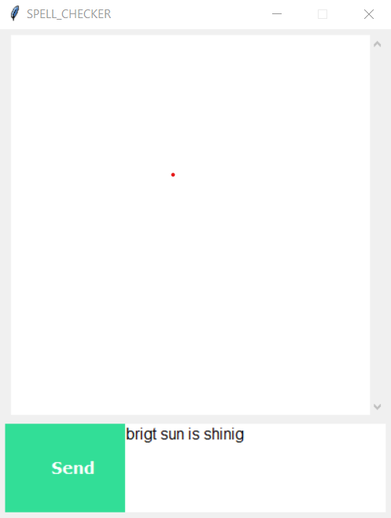
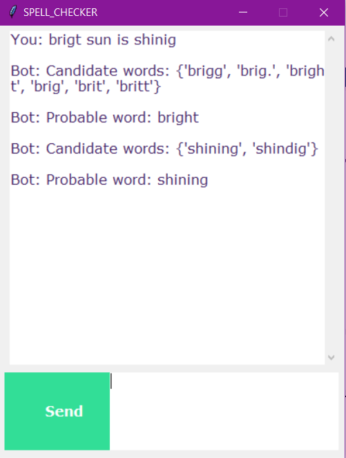

# spell-checker-en
We were given the task to design and implement a spell checker for web search and mining purposes. A Graphical User Interface is created in python using Tkinter. The input is given by the user in the form of a word or sentence or a group of sentences in the chatbot. The output is given in two forms for each identified misspelled word. One in the form of candidate words and other in the most probable word. We have used pyspellchecker for checking and correcting misspelled words.

Steps to run the code locally:
1. Install python3 in the system.
2. Install pyspellchecker. (Eg. in linux terminal type, `sudo pip install pyspellchecker`)
3. Download the gui.py from the repository.
4. Run `python gui.py` in the terminal.

PS: The pyspellchecker uses *Levenshtein Distance Algorithm* to find permutations within an edit distance of 2 from the original word. It then compares all permutations (insertions, deletions, replacements, and transpositions) to known words in a word frequency list. Those words that are found more often in the frequency list are more likely the correct results.

pyspellchecker supports multiple languages including English, Spanish, German, French, and Portuguese. Dictionaries were generated using the [FrequencyWords project](https://github.com/hermitdave/FrequencyWords) on GitHub.

pyspellchecker supports Python 3 and Python 2.7 but, as always, Python 3 is the preferred version!

pyspellchecker allows for the setting of the *Levenshtein Distance* to check. For longer words, it is highly recommended to use a distance of 1 and not the default 2.

The Levenshtein distance between two words is the minimum number of single-character edits (insertions, deletions or substitutions) required to change one word into the other. It is named after the Soviet mathematician [Vladimir Levenshtein](https://en.wikipedia.org/wiki/Vladimir_Levenshtein), who considered this distance in 1965. 

Levenshtein distance may also be referred to as *edit distance*, although that term may also denote a larger family of distance metrics known collectively as edit distance. It is closely related to *pairwise string alignments*.

For example, the Levenshtein distance between "kitten" and "sitting" is 3, since the following three edits change one into the other, and there is no way to do it with fewer than three edits:
1.	kitten --> sitten (substitution of "s" for "k")
2.	sitten --> sittin (substitution of "i" for "e")
3.	sittin --> sitting (insertion of "g" at the end).


**PSEUDOCODE FOR CALCULATING LEVENSHTEIN DISTANCE:** 
```python
function LevenshteinDistance(char s[1..m], char t[1..n]):
  // for all i and j, d[i,j] will hold the Levenshtein distance between
  // the first i characters of s and the first j characters of t
  declare int d[0..m, 0..n]
 
  set each element in d to zero
 
  // source prefixes can be transformed into empty string by
  // dropping all characters
  for i from 1 to m:
      d[i, 0] := i
 
  // target prefixes can be reached from empty source prefix
  // by inserting every character
  for j from 1 to n:
      d[0, j] := j
 
  for j from 1 to n:
      for i from 1 to m:
          if s[i] = t[j]:
            substitutionCost := 0
          else:
            substitutionCost := 1

          d[i, j] := minimum(d[i-1, j] + 1,                   // deletion
                             d[i, j-1] + 1,                   // insertion
                             d[i-1, j-1] + substitutionCost)  // substitution
 
  return d[m, n]
```
**SCREENSHOTS OF THE GUI APPLICATION:** 



**Giving the following input to the program gives the below output**


